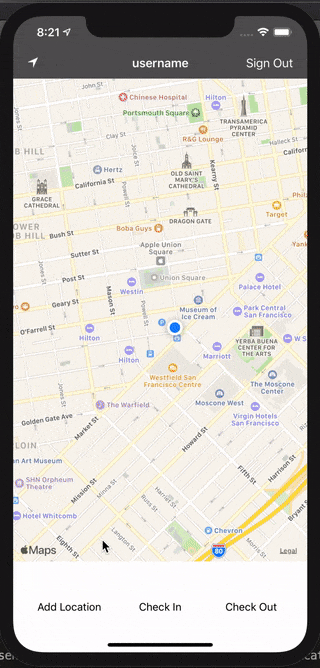

# super-checkin

A location-based check-in application. It has two roles: an admin that can set up events and a user role that can check in and out of events. It uses geo-fencing to make sure the user is actually at the event in attendence. It will use Firebase to store locations in real-time.

